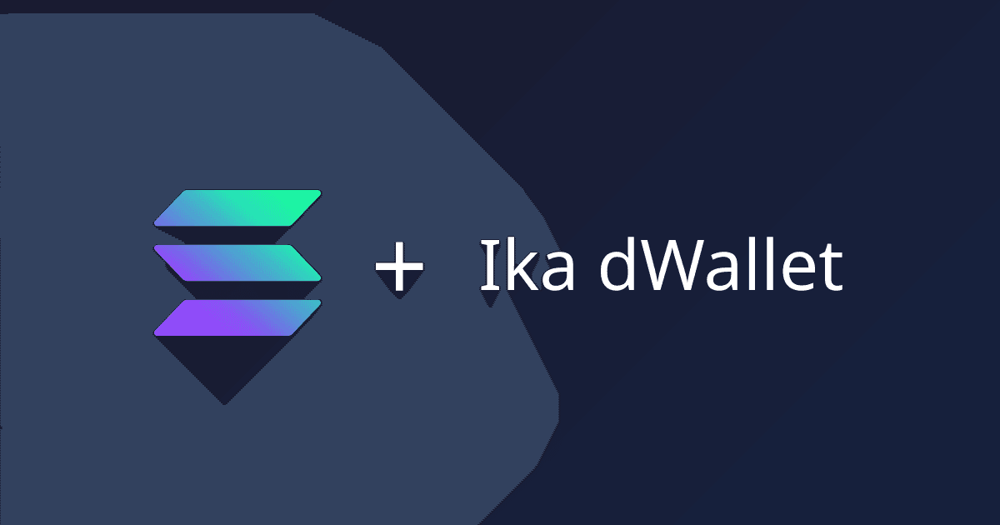

# Ika dWallet: an MPC-controlled Solana account

> A Solana account controlled by threshold MPC. No single key, ever.



Create a real [Ika](https://docs.ika.xyz/docs/core-concepts/dwallets) **dWallet** on the ED25519 curve (its 32-byte public key _is_ a Solana address), then sign and broadcast a real Solana devnet transaction whose signature is produced jointly by you and the Ika network. The full private key is never assembled in one place.

This is a teaching template. Everything is real (real DKG, real 2PC-MPC signing, real Solana broadcast) but scoped to **devnet/testnet** with safe defaults.

## What you'll learn

- What a dWallet is, and how the 2PC-MPC user-share / network-share split works
- That a dWallet can _be_ a Solana account (ED25519) controlled by threshold MPC
- Distributed key generation (DKG) end to end from a web app
- Signing: presign → sign → a real 64-byte EdDSA signature
- Broadcasting that signature as a real Solana devnet transaction
- Which patterns are production-safe vs. teaching shortcuts

## How it works (5 lines)

1. An Ika dWallet is created on the ED25519 curve via real 2PC-MPC.
2. Its 32-byte public key IS a Solana address, no bridge, no wrapping.
3. To sign, you and the Ika network each contribute a share, and neither can sign alone.
4. The result is a 64-byte EdDSA signature that Solana accepts natively.
5. Ika runs on Sui, so a backstage Sui "operator" wallet pays the network fees.

## Two wallets, two roles

| Wallet               | Role                                                                                   | Visibility       |
| -------------------- | -------------------------------------------------------------------------------------- | ---------------- |
| **Phantom (Solana)** | Your own Solana wallet. The on-screen identity and the destination for funds.          | Front and center |
| **The dWallet**      | The MPC-controlled Solana account being created/used. A 2PC-MPC object, not a keypair. | The star         |
| **Sui operator**     | Backstage. Pays the Ika fees (SUI gas + IKA protocol). Funded once via faucets.        | One honest panel |

There's also a **local user-share identity** (a seed in `localStorage`), your half of the 2PC-MPC split, kept distinct from both wallets in the UI.

## Prerequisites

- **Node 22+** and **pnpm**
- **[Phantom](https://phantom.app/)** (or any Wallet-Standard Solana wallet), the human's wallet
- **A Sui wallet** for the backstage operator. Any Wallet-Standard Sui wallet works: [Suiet](https://suiet.app), [Nightly](https://nightly.app), [Slush](https://slush.app/), or **Phantom** itself (enable Sui, then turn on Settings → Developer Settings → Testnet Mode so it can sign Sui testnet transactions). Using Phantom for both roles is fine; just remember they are distinct (Solana wallet vs. Sui operator).

## Quickstart

```bash
pnpm install
cp .env.example .env   # safe devnet/testnet defaults are already filled in
pnpm dev
```

It's a single page, just scroll top to bottom:

1. Connect **Phantom** (top right).
2. Connect a **Sui operator wallet** in the operator panel.
3. Fund the operator: click **Auto-request SUI** (testnet faucet), then visit [faucet.ika.xyz](https://faucet.ika.xyz) once to swap a little SUI → IKA.
4. **Step 1, Create your dWallet:** run DKG → you get a dWallet whose Solana address is shown.
5. **Step 2, Fund & send:** **Airdrop devnet SOL** → **Sign & send** → the signature is verified locally and the tx links to the explorer.

## What this template demonstrates

A single-page, two-step flow:

- **Step 1, Create your dWallet:** a real DKG on Ika testnet. Result: the dWallet's ED25519 public key, shown as a Solana address.
- **Step 2, Fund & send:** airdrop devnet SOL, build a transfer from the dWallet to your Phantom address, produce the EdDSA signature via Ika, verify it locally with `@noble/curves`, splice it in, broadcast, and link to the explorer.

The concepts (2PC-MPC, dWallet-as-address, the two-wallet model, the secp256k1 multi-chain extension) live in [`docs/ika-concepts.md`](./docs/ika-concepts.md) and [`docs/architecture.md`](./docs/architecture.md), and the app links out to the Ika docs where relevant.

## Architecture

See [`docs/architecture.md`](./docs/architecture.md) for the full picture and an ASCII diagram of the dWallet lifecycle. In short:

- `src/lib/ika.ts`: the DKG / global-presign / sign flow against `@ika.xyz/sdk` (ED25519 + EdDSA + SHA512).
- `src/lib/solana.ts`: devnet connection, airdrop, build transfer, splice signature, broadcast.
- `src/lib/sui.ts`: the Sui client, IKA coin type, fee coins (`coinWithBalance`), operator balances + faucet.
- `src/lib/session.ts`: the ephemeral ED25519 user-share identity (`UserShareEncryptionKeys`).
- `src/lib/verify.ts`: local ed25519 verification with `@noble/curves`.

## Caveats

- **Testnet/devnet only.** Solana devnet + Ika/Sui testnet. No mainnet, no real funds.
- **Ephemeral local credentials.** The user-share seed lives in `localStorage`. **Clearing browser storage or switching browsers means you lose access to dWallets created with that seed.** Real apps need durable, encrypted key management.
- **The operator model is a teaching shortcut.** A single Sui wallet paying all fees is convenient for a demo, not a production fee/relayer design.
- **This is not a wallet.** It's a focused demo of the dWallet primitive, meant to be read and extended.

## Extending

See [`docs/extending.md`](./docs/extending.md): swapping to secp256k1 for EVM/BTC, moving to mainnet, replacing `localStorage` with durable storage, and hardening the operator/fee model.

## References

- [Ika SDK docs](https://docs.ika.xyz/docs/sdk) · [`@ika.xyz/sdk`](https://www.npmjs.com/package/@ika.xyz/sdk)
- Ika concepts: [dWallets](https://docs.ika.xyz/docs/core-concepts/dwallets) · [2PC-MPC](https://docs.ika.xyz/docs/core-concepts/cryptography/2pc-mpc) · [Solana integration](https://docs.ika.xyz/docs/solana-integration)
- Ika SDK flow: [zero-trust dWallet (DKG)](https://docs.ika.xyz/docs/sdk/ika-transaction/zero-trust) · [presign](https://docs.ika.xyz/docs/sdk/ika-transaction/presign) · [user-share keys](https://docs.ika.xyz/docs/sdk/user-share-encryption-keys)
- [2PC-MPC paper (eprint 2024/253)](https://eprint.iacr.org/2024/253)
- [ikavery](https://github.com/Iamknownasfesal/ikavery): reference for signing real Solana txs with a Sui-coordinated dWallet
- [Solana docs](https://solana.com/docs) · [`@solana/web3.js`](https://www.npmjs.com/package/@solana/web3.js)

## License

MIT
