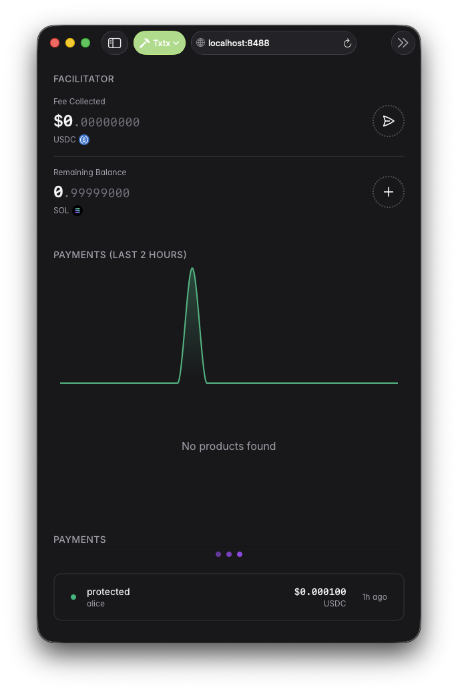
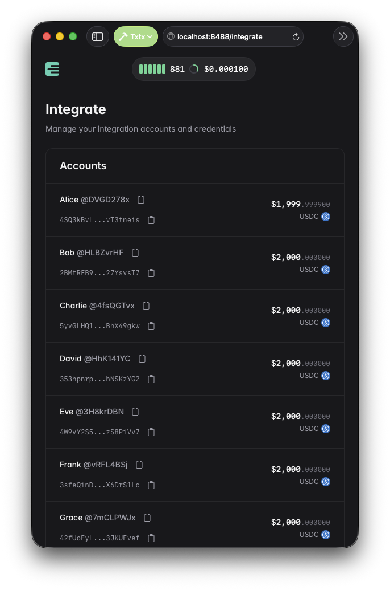
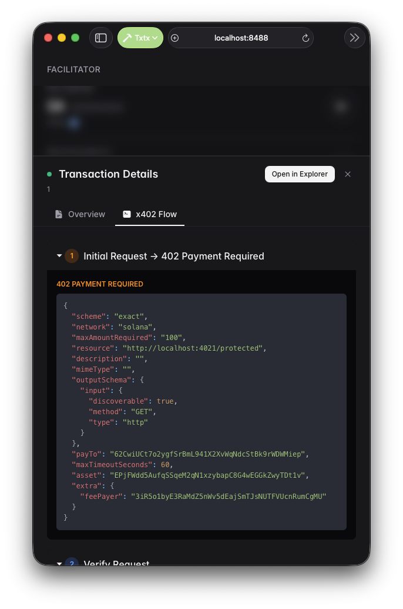

# MoneyMQ x402 Payment Protocol Demo

A complete demonstration of the [x402 payment protocol](https://x402.org/) integrated with [MoneyMQ](https://github.com/txtx/moneymq), enabling micropayment-protected APIs on Solana. This template shows how to build APIs that charge cryptocurrency payments per request, with payments verified on Solana and settled automatically.

**Everything runs locally on your machine** - no external services required, no mainnet, no real money. The demo includes a local Solana blockchain, payment facilitator, API server, and client, all with pre-seeded test accounts ready to use.

## What You'll Build

By the end of this guide, you'll have:

- **A payment-protected API** that charges $0.0001 per request using the x402 protocol
- **A MoneyMQ facilitator** that verifies and settles payments on local Solana
- **A demo client** showing the complete payment flow from request to access

When you run the demo, you'll see:

```shell
━━━━━━━━━━━━━━━━━━━━━━━━━━━━━━━━━━━━━━━━━━━━━━━━━━━━━━━━
X402 + MONEYMQ PAYMENT FLOW DEMONSTRATION
━━━━━━━━━━━━━━━━━━━━━━━━━━━━━━━━━━━━━━━━━━━━━━━━━━━━━━━━

[1/4] Initializing payment signer
  → Network: solana
  → Payer address: DVGD...YiNT
  ✓ Signer initialized

[2/4] Attempting to access protected endpoint without payment
  → GET http://localhost:4021/protected
  → Response: 402 Payment Required
  ✅ Status code: 402

[3/4] Accessing protected endpoint with x402 payment
  → Using x402 fetch wrapper
  → Payment will be processed via MoneyMQ facilitator
  → Transaction submitted to local Solana
  ✅ Status code: 200

[4/4] Processing response data
  ✓ Payment response decoded

━━━━━━━━━━━━━━━━━━━━━━━━━━━━━━━━━━━━━━━━━━━━━━━━━━━━━━━━
SUCCESS: Payment completed and API accessed
━━━━━━━━━━━━━━━━━━━━━━━━━━━━━━━━━━━━━━━━━━━━━━━━━━━━━━━━
```

## Features

- **x402 Payment Protocol** - HTTP 402 "Payment Required" standard for API monetization
- **MoneyMQ Integration** - Built-in facilitator for payment verification and settlement
- **Local Solana Blockchain** - Embedded validator for development and testing
- **Pre-seeded Test Accounts** - Ready-to-use wallets with USDC balance
- **Zero Configuration** - Everything works out of the box
- **TypeScript** - Fully typed client and server code

## What is x402?

[x402](https://x402.org/) is an open payment protocol that uses HTTP status code **402 "Payment Required"** to enable seamless cryptocurrency payments for web content and APIs.

**Key Benefits:**

- **Direct Payments** - Accept cryptocurrency without third-party payment processors
- **No User Accounts** - No registration or authentication required
- **Blockchain-Verified** - Payments verified directly on Solana
- **AI Agent Compatible** - Enable AI agents to autonomously pay for API services
- **Standard HTTP** - Works with existing web infrastructure

**How It Works:**

1. Client requests protected content → Server responds with 402 Payment Required
2. Client creates payment transaction with x402 fetch wrapper
3. Client sends payment to facilitator for verification
4. Facilitator validates and settles transaction on Solana
5. Server verifies payment and returns protected content

## What is MoneyMQ?

[MoneyMQ](https://github.com/txtx/moneymq) is a standalone CLI that provides:

- **Built-in Facilitator** - x402 payment verification and settlement (powered by [Kora](https://github.com/solana-foundation/kora))
- **Local Blockchain** - Embedded Solana validator for development (powered by [Surfpool](https://github.com/txtx/surfpool))
- **Pre-seeded Accounts** - Test accounts with USDC ready to use
- **Fee Management** - Automatic handling of transaction fees
- **Studio Web UI (Local)** - View account balances and keys at `http://localhost:8488/integrate`

In this demo, MoneyMQ handles all blockchain complexity, letting you focus on building your API.

## Prerequisites

Before you start, make sure you have:

1. **Rust** (latest stable) - [Install Rust](https://www.rust-lang.org/tools/install)
2. **Node.js 18+** - [Download Node.js](https://nodejs.org/)
3. **pnpm** - Install with `npm install -g pnpm`
4. Basic understanding of [Solana transactions](https://solana.com/docs/core/transactions)

## Setup Steps

### 1. Install MoneyMQ

First, install the MoneyMQ CLI tool:

```bash
git clone https://github.com/txtx/moneymq.git
cd moneymq
cargo moneymq-install
```

This installs the `moneymq` command globally. You can verify with:

```bash
moneymq --version
```

### 2. Clone this template

```bash
git clone https://github.com/solana-foundation/templates.git
cd templates/community/moneymq-x402
```

This gets you the demo code with the API server and client.

### 3. Install dependencies

Install Node.js dependencies for both the API and client:

```bash
# Install dependencies for both API and client
pnpm run install:all
```

This installs all required packages including `x402-express` for the server and `x402-fetch` for the client.

### 4. Configure environment variables

Copy the example environment file:

```bash
cp .env.example .env
```

The `.env` file contains pre-configured addresses that work with MoneyMQ sandbox:

```env
# MoneyMQ facilitator URL
FACILITATOR_URL=http://localhost:7781

# API configuration
PROTECTED_API_URL=http://localhost:4021/protected
API_PORT=4021

# The address that receives payments
PAYOUT_RECIPIENT_ADDRESS=62CwiUCt7o2ygfSrBmL941X2XvWqNdcStBk9rWDWMiep

# Customer wallet (pre-seeded with 2000 USDC)
PAYER_ADDRESS=DVGD278xQEJxKhYZBPkcPEbcncFV6HsdwUoe45LNYiNT
PAYER_PRIVATE_KEY=4SQ3kBvLqeAXoRMhXgRUG27ehizp6R5vQMhu4HAM3R8g...

# Enable debug logging (optional)
DEBUG=false
```

**Note:** These addresses are automatically created by MoneyMQ sandbox with pre-seeded USDC balances. You don't need to change them for local testing.

## Running the Demo

You'll need **three terminal windows** to run all components.

### Terminal 1: Start MoneyMQ Sandbox

From your MoneyMQ repository (not this directory):

```bash
moneymq sandbox
```

You should see:

```text
# Payment API (protocol: x402, paying with 3iR5o1byE3RaMdZ5nWv5dEajSmTJsNUTFVUcnRumCgMU)
   GET http://localhost:7781/supported
  POST http://localhost:7781/verify
  POST http://localhost:7781/settle

MoneyMQ Studio:: http://localhost:8488 - Press Ctrl+C to stop
```

**MoneyMQ Studio Dashboard:**

MoneyMQ includes a web interface for monitoring your local blockchain. Open [http://localhost:8488](http://localhost:8488) to see the dashboard:



**View Pre-Seeded Accounts:**

Navigate to the [Integrate page](http://localhost:8488/integrate) to see all test accounts with their USDC balances and private keys. This is helpful for understanding which accounts are being used:



The sandbox provides:

- **x402 Facilitator** at `http://localhost:7781` - Verifies and settles payments
- **Local Solana RPC** at `http://localhost:8899` - Local blockchain for testing
- **Pre-seeded Accounts** - Multiple test wallets with 2000 USDC each

### Terminal 2: Start Protected API

```bash
pnpm run start:api
```

You should see:

```text
Server listening at http://localhost:4021
```

This starts the payment-protected API server using `x402-express` middleware.

### Terminal 3: Run Client Demo

```bash
pnpm run demo
```

You should see the complete payment flow demonstration with output showing:

1. Payment signer initialization
2. Failed request without payment (402 status)
3. Successful payment via MoneyMQ facilitator
4. Access granted with payment receipt

The client demonstrates how to use the `x402-fetch` wrapper to automatically handle payments when accessing protected endpoints.

**View Transaction in MoneyMQ Studio:**

After the demo runs successfully, you can view the payment transaction in MoneyMQ Studio. The transaction view shows the payment details, including the sender, recipient, and amount:



## Understanding the Code

### The Protected API Server

The API server (`api/src/api.ts`) uses the `x402-express` middleware to protect endpoints:

```typescript
import { Network, paymentMiddleware, SolanaAddress } from 'x402-express'

const PAYOUT_RECIPIENT_ADDRESS = process.env.PAYOUT_RECIPIENT_ADDRESS as SolanaAddress
const FACILITATOR_URL = process.env.FACILITATOR_URL

app.use(
  paymentMiddleware(
    PAYOUT_RECIPIENT_ADDRESS, // Where payments are sent
    {
      'GET /protected': {
        price: '$0.0001', // Price per request
        network: 'solana',
      },
    },
    {
      url: FACILITATOR_URL, // MoneyMQ facilitator
    },
  ),
)

app.get('/protected', (req, res) => {
  res.json({
    message: 'Protected endpoint accessed successfully',
    timestamp: new Date().toISOString(),
  })
})
```

**What happens:**

- Middleware intercepts requests to `/protected`
- Returns 402 status if payment is missing or invalid
- Validates payments via MoneyMQ facilitator
- Allows access after successful payment verification

### The Client Application

The client (`client/src/index.ts`) demonstrates the x402 payment flow:

```typescript
import { createSigner, wrapFetchWithPayment } from 'x402-fetch'

// Create signer from private key
const payer = await createSigner('solana', PAYER_PRIVATE_KEY)

// Wrap fetch with x402 payment capabilities
const fetchWithPayment = wrapFetchWithPayment(fetch, payer, undefined, undefined, {
  svmConfig: { rpcUrl: 'http://localhost:8899' },
})

// First attempt: Regular fetch (fails with 402)
const expect402Response = await fetch(PROTECTED_API_URL)
console.log(`Status: ${expect402Response.status}`) // 402

// Second attempt: Fetch with payment (succeeds)
const response = await fetchWithPayment(PROTECTED_API_URL)
console.log(`Status: ${response.status}`) // 200
```

**What the x402 fetch wrapper does:**

- Detects 402 responses from the server
- Creates payment transaction based on server requirements
- Signs transaction with user's private key
- Submits to MoneyMQ for verification and settlement
- Retries request with payment proof
- Returns successful response with content

## Customizing the Demo

### Change API Pricing

Edit `api/src/api.ts` to adjust prices or add more endpoints:

```typescript
app.use(
  paymentMiddleware(
    PAYOUT_RECIPIENT_ADDRESS,
    {
      'GET /protected': {
        price: '$0.0001',
        network: 'solana',
      },
      'GET /premium': {
        price: '$0.01',
        network: 'solana',
      },
      'POST /api/data': {
        price: '$0.05',
        network: 'solana',
      },
    },
    {
      url: FACILITATOR_URL,
    },
  ),
)
```

Then add corresponding route handlers:

```typescript
app.get('/premium', (req, res) => {
  res.json({ message: 'Premium content accessed' })
})
```

### Enable Debug Logging

Set `DEBUG=true` in your `.env` file to see detailed logs:

```bash
DEBUG=true
```

This shows:

- Request/response details
- Payment transaction data
- Facilitator verification steps
- Transaction signatures

## Troubleshooting

| Issue                                  | Solution                                                                                                                                                              |
| -------------------------------------- | --------------------------------------------------------------------------------------------------------------------------------------------------------------------- |
| Port already in use (7781, 8899, 4021) | Check what's using the ports with `lsof -i :PORT` and stop conflicting processes                                                                                      |
| MoneyMQ not found                      | Make sure you ran `cargo moneymq-install` and the binary is in your PATH                                                                                              |
| 402 errors not resolving               | Verify MoneyMQ sandbox is running and accessible at `http://localhost:7781`                                                                                           |
| USDC balance too low                   | Visit `http://localhost:8488/integrate` to view account balances. Sandbox accounts start with 2000 USDC                                                               |
| RPC connection errors                  | Ensure local Solana validator is healthy: `curl http://localhost:8899 -X POST -H "Content-Type: application/json" -d '{"jsonrpc":"2.0","id":1,"method":"getHealth"}'` |
| Payment verification fails             | Check that `FACILITATOR_URL` in `.env` matches MoneyMQ sandbox URL (`http://localhost:7781`)                                                                          |
| Module not found errors                | Run `pnpm install` in both `api/` and `client/` directories                                                                                                           |

If you're still stuck, check the terminal where each service is running. Error messages usually indicate the specific issue.

## Project Structure

```text
moneymq-x402/
├── api/
│   ├── src/
│   │   └── api.ts              # Express server with x402 middleware
│   └── package.json            # API dependencies
├── client/
│   ├── src/
│   │   └── index.ts            # Demo client with x402-fetch
│   ├── package.json            # Client dependencies
│   └── tsconfig.json
├── .env.example                # Environment template
├── package.json                # Root package with convenience scripts
└── README.md
```

**Key Files:**

- `api/src/api.ts` - Payment-protected API using `x402-express` middleware
- `client/src/index.ts` - Demo client showing payment flow with `x402-fetch`
- `.env.example` - Pre-configured environment variables for local testing

## Use Cases

This architecture enables:

- **AI Agent Marketplaces** - Let AI agents autonomously pay for API services
- **Pay-Per-Use APIs** - Charge for individual API calls instead of subscriptions
- **Micropayment Content** - Monetize content with tiny per-access fees
- **Usage-Based SaaS** - Bill based on actual consumption
- **Decentralized Services** - Enable services without centralized payment processors

## Additional Resources

### x402 Protocol

- [x402 Website](https://x402.org/)
- [x402 Documentation](https://x402.gitbook.io/x402/)
- [x402 GitHub](https://github.com/coinbase/x402)
- [x402 TypeScript SDK](https://www.npmjs.com/package/x402)
- [x402-express Package](https://www.npmjs.com/package/x402-express)
- [x402-fetch Package](https://www.npmjs.com/package/x402-fetch)

### MoneyMQ

- [MoneyMQ GitHub](https://github.com/txtx/moneymq)
- [MoneyMQ Documentation](https://github.com/txtx/moneymq/tree/main/docs)

### Kora (Powers MoneyMQ's Facilitator)

- [Kora GitHub](https://github.com/solana-foundation/kora)
- [Kora x402 Demo](https://github.com/solana-foundation/kora/tree/main/docs/x402/demo) - Original implementation this demo is based on
- [Kora Configuration Guide](https://github.com/solana-foundation/kora/blob/main/docs/operators/CONFIGURATION.md)

### Solana

- [Solana Documentation](https://solana.com/docs)
- [Solana Explorer](https://explorer.solana.com/)
- [SPL Token Program](https://spl.solana.com/token)

## Acknowledgments

This template demonstrates the x402 payment protocol integration with MoneyMQ. The facilitator implementation is powered by [Kora](https://github.com/solana-foundation/kora), the Solana Foundation's gasless transaction signing infrastructure.

**Credits:** This example is heavily inspired by the [original Kora x402 demo](https://github.com/solana-foundation/kora/tree/main/docs/x402/demo). We're grateful to the Kora team for pioneering this integration pattern.

## License

MIT License - Feel free to use this template for your projects.
