# Solana Blinks - Axum

Rust template for [Solana Actions](https://solana.com/developers/guides/advanced/actions) using Axum. Actions are a spec where any URL can serve as an interactive transaction endpoint. A client GETs the URL to get a form description (title, icon, input fields), the user fills it out, the client POSTs back, and the server returns an unsigned transaction for the wallet to sign. When these URLs get unfurled in wallets or social apps, they show up as **Blinks** (Blockchain Links).

Three example actions are included: SOL transfers, a donation flow with action chaining (transfer then on-chain memo), and a swap placeholder you can wire up to Jupiter/Raydium.

## How it works

```mermaid
sequenceDiagram
    participant Client as Client
    participant Axum as Axum Server
    participant RPC as Solana RPC
    participant Solana as Solana Cluster

    Client->>Axum: GET /actions.json
    Axum-->>Client: routing rules

    Client->>Axum: GET /api/actions/{name}
    Axum-->>Client: { icon, title, description, parameters[] }

    Client->>Axum: POST /api/actions/{name}?params...<br/>{ account: "pubkey" }
    Axum->>RPC: get_balance, get_account
    RPC-->>Axum: balances
    Axum->>RPC: get_latest_blockhash
    RPC-->>Axum: blockhash
    Axum->>Axum: build unsigned tx, base64 encode
    Axum-->>Client: { transaction, message, links.next? }

    Client->>Client: wallet signs tx
    Client->>Solana: sendTransaction
    Solana-->>Client: confirmed

    Note over Client,Axum: Action chaining (optional)
    rect rgb(40, 40, 55)
        Client->>Axum: POST ...?_chain=base64state&params...
        Axum->>Axum: decode chain state from previous step
        Axum-->>Client: next unsigned tx
    end
```



## Actions included

- **Transfer** - Send SOL to any address. Validates balance, checks rent exemption for new accounts, builds a `system_instruction::transfer`.

- **Donate + Memo** - Two-step chained flow. Step 1: user picks an amount, server builds a transfer to the treasury and returns the transaction along with an inline next action (the memo form). Step 2: user types a message, server builds a Memo program instruction with the donation amount carried over from step 1 via the `_chain` URL parameter. No server-side state involved.

- **Swap** - Shows the UI pattern for a token swap (token selector + amount). Currently writes a memo instead of doing an actual swap. Replace the memo instruction with DEX calls to make it real.

## Project structure

```
src/
├── main.rs            # bootstrap, env config, graceful shutdown
├── router.rs          # routes, AppState, GET/POST handlers
├── spec.rs            # Solana Actions spec types (serde structs)
├── error.rs           # AppError -> HTTP status + JSON body
├── cors.rs            # CORS layer (required by the spec)
├── consts.rs          # constants, treasury address, memo program ID
├── state.rs           # ChainState for passing data between chained steps
└── actions/
    ├── mod.rs         # module declarations and re-exports
    ├── registry.rs    # Action trait, ActionRegistry, register_actions! macro
    ├── utils.rs       # shared helpers (get_param, serialize_tx, build_memo_tx, …)
    ├── transfer.rs    # SOL transfer
    ├── donate.rs      # donate + memo chain
    └── swap.rs        # swap placeholder
```

## Getting started

```bash
cp .env.example .env    # defaults to mainnet RPC - change to devnet if you want
cargo run               # starts on 0.0.0.0:3000
```

Test it:

```bash
curl http://localhost:3000/api/actions/transfer

curl -X POST "http://localhost:3000/api/actions/transfer?to=DAw5ebjQBFruAFb7aehTTdbWixeTS3oS1BUAiZtKAvea&amount=0.01" \
  -H "Content-Type: application/json" \
  -d '{"account":"YOUR_PUBKEY"}'
```

### Environment variables

| Variable   | Default                               |                                                           |
| ---------- | ------------------------------------- | --------------------------------------------------------- |
| `RPC_URL`  | `https://api.mainnet-beta.solana.com` | Solana RPC endpoint                                       |
| `HOST`     | `0.0.0.0`                             | Bind address                                              |
| `PORT`     | `3000`                                | Listen port                                               |
| `RUST_LOG` | -                                     | Tracing filter, e.g. `info` or `solana_blinks_axum=debug` |

## Writing your own action

Every action implements two methods - `metadata` (what the client shows) and `execute` (build the transaction):

```rust
// src/actions/my_action.rs
use crate::actions::*;
use crate::error::AppError;
use crate::spec::*;

pub struct MyAction;

#[async_trait]
impl Action for MyAction {
    async fn metadata(&self, _rpc: &RpcClient) -> Result<ActionGetResponse, AppError> {
        Ok(ActionGetResponse::new(
            "https://example.com/icon.png",
            "My Action",
            "Does something cool",
            "Do It",
        ).with_links(vec![
            LinkedAction {
                href: "/api/actions/my-action?param={param}".into(),
                label: "Do It".into(),
                parameters: Some(vec![
                    ActionParameter::text("param", "Enter a value", true),
                ]),
            },
        ]))
    }

    async fn execute(
        &self,
        rpc: &RpcClient,
        account: Pubkey,
        params: HashMap<String, String>,
    ) -> Result<ActionPostResponse, AppError> {
        let param: String = get_param(&params, "param")?;

        let ix = /* your instruction */;
        let blockhash = rpc.get_latest_blockhash().await?;
        let msg = Message::new_with_blockhash(&[ix], Some(&account), &blockhash);
        let tx = Transaction::new_unsigned(msg);

        Ok(ActionPostResponse {
            transaction: serialize_tx(&tx)?,
            message: Some(format!("Did the thing with {param}")),
            links: None,
        })
    }
}
```

Register it in `router.rs`:

```rust
let registry = register_actions![
    TransferAction,
    SwapAction,
    DonateAction,
    DonateMemoAction,
    MyAction,  // add it here
];
```

The macro auto-generates `actions.json` routing rules from each action's `path()`. Done - GET returns the form, POST returns a transaction.

### Helpers in `actions/utils.rs`

- `get_param::<T>(params, key)` - extract and parse a query param, or return a 400
- `sol_to_lamports(sol)` / `lamports_to_sol(lamports)` - unit conversion
- `serialize_tx(tx)` - bincode serialize + base64 encode
- `build_memo_tx(rpc, payer, text)` - build a ready-to-go Memo program transaction

## Action chaining

For multi-step flows, `ChainState` passes data between steps via a `_chain` query parameter. It's a `HashMap<String, String>` that gets serialized to URL-safe base64 JSON. The server stores nothing.

```rust
// Step 1: stash data for the next step
let mut chain = ChainState::new();
chain.set("amount", &format!("{amount_sol}"));
let next_href = chain.encode_into("/api/actions/donate/memo");
// → "/api/actions/donate/memo?_chain=eyJhbW91bnQiOiIwLjUifQ"

// Step 2: read it back
let chain = ChainState::decode_from(&params)?;
let amount = chain.get("amount")?;
```

Return the next step as either:

- `NextAction::Inline` - embed the full next action in the response, client renders it immediately (used for the memo form after donate)
- `NextAction::Post` - return a URL, client fetches it to get the next action

## Error handling

Errors go through `AppError` in `error.rs`:

| Variant              | Status |                                  |
| -------------------- | ------ | -------------------------------- |
| `BadRequest(msg)`    | 400    | bad params, insufficient balance |
| `NotFound(msg)`      | 404    | unknown action path              |
| `Rpc(err)`           | 500    | Solana RPC failure               |
| `Serialization(err)` | 500    | tx serialization failure         |

All errors return `{ "message": "..." }` JSON, matching the Actions spec `ActionError` format.

## API routes

|      | Path                                       |                                               |
| ---- | ------------------------------------------ | --------------------------------------------- |
| GET  | `/actions.json`                            | action manifest (routing rules)               |
| GET  | `/api/actions/transfer`                    | transfer form metadata                        |
| POST | `/api/actions/transfer?to=X&amount=Y`      | build SOL transfer tx                         |
| GET  | `/api/actions/donate`                      | donate form metadata                          |
| POST | `/api/actions/donate?amount=Y`             | build treasury transfer tx + inline memo form |
| POST | `/api/actions/donate/memo?_chain=X&memo=Y` | build memo tx                                 |
| GET  | `/api/actions/swap`                        | swap form metadata                            |
| POST | `/api/actions/swap?from_token=X&amount=Y`  | placeholder (memo tx)                         |
