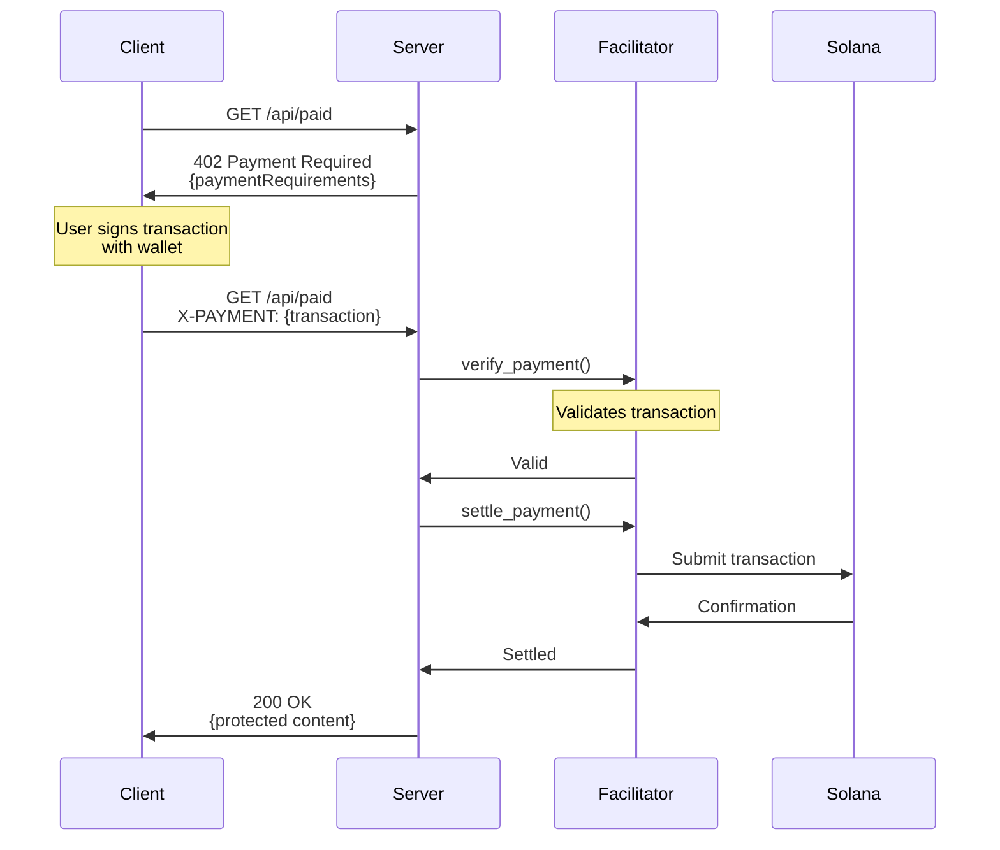

# x402 Solana Payment Server

A production-ready Rust template for building HTTP APIs with x402 payment integration on Solana. Accept USDC payments for API access using the x402 protocol.

## Overview

This template provides a complete server implementation supporting the [x402 payment protocol](https://x402.org) for Solana. It enables you to create paid API endpoints where users pay with USDC to access protected content.

**Key Features:**

- **Pure Rust** - Type-safe, high-performance, memory-safe
- **x402 Protocol** - Standard HTTP 402 payment protocol for Solana
- **Multi-Framework** - Choose Axum, Actix, or Rocket
- **Production Ready** - CORS, logging, error handling included
- **Zero Config** - Works out of the box with sensible defaults
- **Testing UI** - Web-based frontend for testing payments

## Payment Flow



## Quick Start

### Installation

Create a new project with one command:

```bash
# Create from template
npx create-solana-dapp my-project --template x402-solana-rust
```

```bash
# Navigate to project
cd my-project
```

```bash
# Initialize the project with a framework(Axum, Actix or Rocket)
node create
# Choose 1, 2 or 3 when prompted
```

### Configuration

Copy environment template and add your Solana wallet:

```bash
cp .env.example .env
# Edit .env - set RECEIVER_WALLET_ADDRESS
```

### Run

Start the server:

```bash
cargo run
```

### Test

**Web UI (Recommended):**

```bash
cd frontend
npm install
cp .env.example .env
# Edit .env - add your keypair
npm run dev
```

## API Endpoints

| Endpoint      | Method | Description                  | Payment Required |
| ------------- | ------ | ---------------------------- | ---------------- |
| `/api/health` | GET    | Health check and server info | No               |
| `/api/free`   | GET    | Free access endpoint         | No               |
| `/api/paid`   | GET    | Protected content            | Yes (USDC)       |

## Configuration Reference

### Required

- `RECEIVER_WALLET_ADDRESS` - Your Solana wallet to receive payments

### Optional

- `SOLANA_NETWORK` - `solana-devnet` or `solana-mainnet` (default: devnet)
- `SOLANA_RPC_URL` - RPC endpoint (default: devnet public RPC)
- `USDC_MINT_ADDRESS` - USDC token address (default: devnet USDC)
- `DEFAULT_PRICE` - Price in micro-USDC (default: 10000 = $0.01)
- `HOST` - Server bind address (default: localhost)
- `PORT` - Server port (default: 3000)

## Project Structure

```
.
├── facilitator/          # Payment facilitator implementations
│   ├── local.rs          # Direct blockchain submission locally
│   ├── traits.rs         # Facilitator trait
│   └── utils.rs          # Common txn utilities
├── frameworks/           # Framework templates
│   ├── axum/             # Axum implementation
│   ├── actix/            # Actix implementation
│   └── rocket/           # Rocket implementation
├── shared/               # Shared code
│   ├── config.rs         # Configuration(env)
│   ├── types.rs          # x402 types
│   ├── verification.rs   # Payment verification functions
│   └── error.rs          # Error enum
├── frontend/             # Testing UI
└── create.js             # Project generator
```

## Development

### Adding Protected Endpoints

1. Create a new route handler
2. Use the `verify_payment()` function
3. Return `PaymentResult` enum
4. Mount the route

See framework-specific documentation in `frameworks/<framework>/`

## Security Considerations

### CORS Configuration

**IMPORTANT**: This template uses permissive CORS settings for development convenience. **Before deploying to production or mainnet**, you MUST update the CORS configuration to restrict origins.

The current configuration allows requests from ANY origin, which poses a security risk in production environments.

See the inline code comments in `src/main.rs` for production configuration examples (Axum, Actix, Rocket).

## Resources

- [x402 Protocol Specification](https://x402.org)
- [Frontend Documentation](frontend/README.md)
- [Solana Documentation](https://docs.solana.com)

## License

MIT License - see [LICENSE](LICENSE) file for details

## Contributors

- **[0xsouravm](https://github.com/0xsouravm)** - Sourav Mishra
- **[crypto-priest](https://github.com/crypto-priest)** - Mahavir Ganapati Dash
