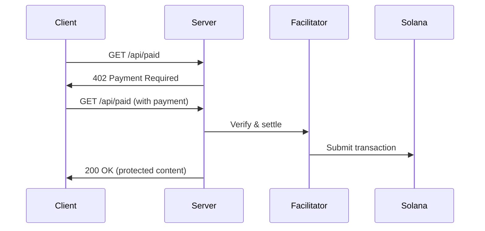

# {{name}}

A production-ready Rust server built with **Actix Web** for HTTP APIs with x402 payment integration on Solana.

## Features

- **Actix Web Framework** - High-performance, actor-based web framework
- **x402 Protocol** - HTTP 402 payment protocol for Solana
- **USDC Payments** - Accept USDC for API access
- **Production Ready** - CORS, logging, error handling included
- **Testing UI** - Web frontend for testing payments

## Payment Flow



## Quick Start

### Configuration

```bash
cp .env.example .env
# Edit .env - set RECEIVER_WALLET_ADDRESS
```

### Run

```bash
cargo run
```

Server starts on `http://localhost:3000`

### Test

**Web UI:**

```bash
cd frontend
npm install
cp .env.example .env
# Edit .env - add your keypair
npm run dev
```

Visit `http://localhost:5173`

**Manual:**

```bash
curl http://localhost:3000/api/health
curl http://localhost:3000/api/free
curl http://localhost:3000/api/paid
```

## API Endpoints

| Endpoint      | Method | Payment Required | Description                  |
| ------------- | ------ | ---------------- | ---------------------------- |
| `/api/health` | GET    | No               | Health check and server info |
| `/api/free`   | GET    | No               | Free access endpoint         |
| `/api/paid`   | GET    | Yes (USDC)       | Protected content (demo)     |

## Configuration

### Required

- `RECEIVER_WALLET_ADDRESS` - Your Solana wallet

### Optional

- `SOLANA_NETWORK` - `solana-devnet` or `solana-mainnet` (default: devnet)
- `SOLANA_RPC_URL` - RPC endpoint
- `USDC_MINT_ADDRESS` - USDC token address
- `DEFAULT_PRICE` - Price in micro-USDC (default: 10000 = $0.01)
- `HOST` - Bind address (default: localhost)
- `PORT` - Port (default: 3000)

## Project Structure

```
{{name}}/
├── src/
│   ├── main.rs              # Server entry point & routing
│   ├── facilitator/         # Payment processing
│   │   ├── mod.rs           # Module exports
│   │   ├── local.rs         # Local facilitator implementation
│   │   ├── traits.rs        # Facilitator trait definitions
│   │   └── utils.rs         # Transaction utilities
│   ├── routes/              # API route handlers
│   │   ├── mod.rs           # Route module exports
│   │   ├── health.rs        # Health check endpoint
│   │   ├── free.rs          # Free endpoint
│   │   └── paid.rs          # Protected endpoint
│   └── shared/              # Shared utilities
│       ├── mod.rs           # Shared module exports
│       ├── config.rs        # Configuration management
│       ├── types.rs         # x402 types
│       ├── verification.rs  # Payment verification
│       └── error.rs         # Error types
├── frontend/                # Testing UI
├── Cargo.toml               # Rust dependencies
└── README.md                # This file
```

## Resources

- [Actix Web Documentation](https://actix.rs/)
- [x402 Protocol](https://x402.org)
- [Frontend Documentation](frontend/README.md)
- [Solana Documentation](https://docs.solana.com)

## License

MIT License - see [LICENSE](LICENSE)
