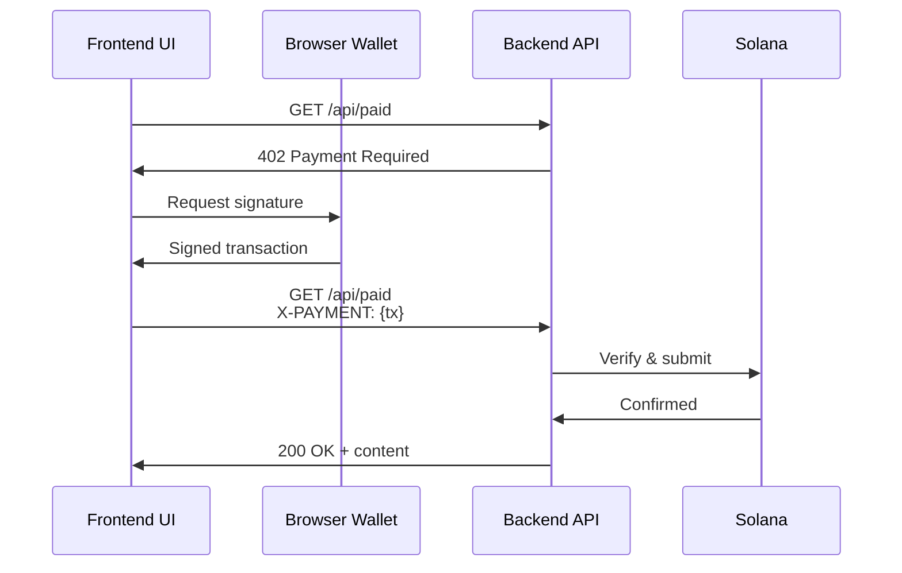

# x402 Payment Testing UI

Web-based interface for testing x402 Solana payment API endpoints with wallet integration and real-time logging.

## Features

- **Interactive UI** - Test all API endpoints visually
- **Wallet Integration** - Load and use Solana wallets
- **Payment Testing** - Sign and submit USDC payments
- **Real-time Logs** - Track requests, responses, and transactions
- **Network Switching** - Toggle between devnet and mainnet
- **Framework Detection** - Automatically detects backend framework

## Quick Start

### Installation

```bash
cd frontend
npm install
```

### Configuration

```bash
cp .env.example .env
```

Edit `.env` and configure:

- `VITE_SIGNER_KEYPAIR` - Your wallet keypair (JSON array format)
- `VITE_API_BASE_URL` - Backend API URL (default: http://localhost:3000)

### Generate a Test Wallet

```bash
solana-keygen new --no-bip39-passphrase --outfile keypair.json
cat keypair.json
# Copy the array and paste into .env as VITE_SIGNER_KEYPAIR
```

### Run

```bash
npm run dev
```

Opens at `http://localhost:5173`

## Usage

### 1. Load Wallet

Click "Load Wallet from .env" to initialize your Solana wallet. Your public key will be displayed.

### 2. Fund Wallet (Devnet)

Get devnet SOL and USDC:

```bash
# Devnet SOL (for transaction fees)
solana airdrop 2 YOUR_WALLET_ADDRESS --url devnet

# Devnet USDC
# Use Solana faucets or Circle's devnet USDC faucet
```

### 3. Test Endpoints

#### Health Check

- Click "Test" under Health Check
- No payment required
- Returns server status and configuration

#### Free Endpoint

- Click "Test" under Free Endpoint
- No payment required
- Returns free content

#### Paid Endpoint

**Without Payment:**

- Click "Test (No Payment)"
- Receives 402 Payment Required with payment terms

**With Payment:**

- Click "Test (With Payment)"
- Automatically:
  1. Gets payment requirements
  2. Builds USDC transfer transaction
  3. Signs with your wallet
  4. Submits payment proof
  5. Receives protected content

### 4. View Activity Logs

All requests, responses, and transaction details appear in the Activity Log at the bottom.

## Environment Variables

### Required

- `VITE_SIGNER_KEYPAIR` - Wallet keypair as JSON array

### Optional

- `VITE_API_BASE_URL` - Backend URL (default: http://localhost:3000)
- `VITE_DEVNET_RPC_URL` - Devnet RPC endpoint
- `VITE_MAINNET_RPC_URL` - Mainnet RPC endpoint

## Project Structure

```
frontend/
├── index.html          # Main HTML
├── style.css           # Styles
├── src/
│   ├── main.ts         # Entry point
│   ├── config.ts       # Configuration
│   ├── apis/           # API definitions
│   │   ├── index.ts    # Auto-discovery
│   │   ├── BaseAPI.ts  # Base class
│   │   ├── HealthAPI.ts
│   │   ├── FreeAPI.ts
│   │   └── PaidAPI.ts  # Payment logic
│   └── utils/          # Utilities
│       ├── logger.ts   # Activity logging
│       ├── wallet.ts   # Wallet management
│       ├── network.ts  # Network switching
│       └── uiGenerator.ts # UI generation
└── .env.example        # Config template
```

## Adding Custom Endpoints

The frontend uses **automatic API discovery**. To add a new endpoint:

1. Create `src/apis/YourAPI.ts`
2. Extend `BaseAPI` class
3. That's it! UI automatically generates

The system automatically:

- Discovers all `*API.ts` files
- Generates UI elements
- Registers event listeners
- Handles responses

## Payment Flow



## Troubleshooting

### "No wallet loaded"

- Click "Load Wallet from .env"
- Ensure `VITE_SIGNER_KEYPAIR` is set correctly as JSON array

### "Failed to create payment"

- Check devnet SOL balance (need ~0.001 SOL for fees)
- Check devnet USDC balance
- Verify RPC URL is accessible
- Check browser console for errors

### CORS Errors

- Ensure backend server is running
- Verify backend has CORS enabled
- Check `VITE_API_BASE_URL` points to correct server

### Connection Refused

- Start backend server first
- Check backend is on correct port (default: 3000)

## Resources

- [Main README](../README.md)
- [x402 Protocol](https://x402.org)
- [Solana Web3.js Docs](https://solana-labs.github.io/solana-web3.js/)

---

Built for testing x402 payment APIs on Solana
