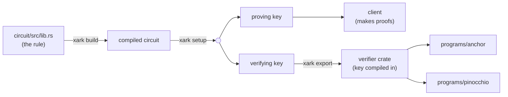
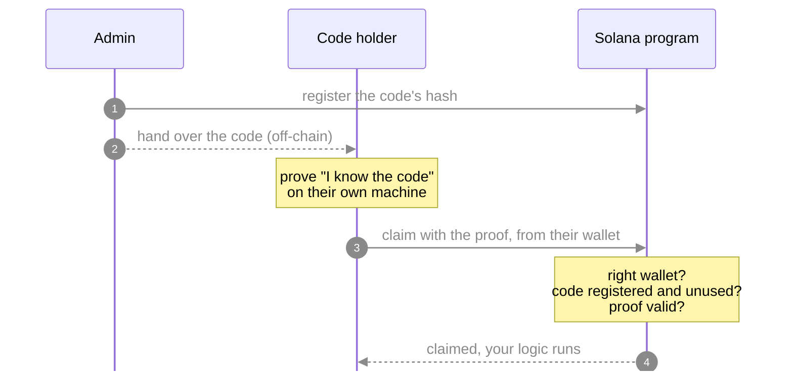

# xark ZK Starter

Zero-knowledge proofs on Solana, all in Rust. A circuit written with
[xark](https://github.com/blueshift-gg/xark) is verified on-chain by two
equivalent programs, one in **Anchor** and one in **Pinocchio**, driven by one
Rust client and one LiteSVM test suite.

The example app is a **secret-code claim**: an admin publishes the hash of a
code, and whoever knows the code can claim it once, from their own wallet,
without the code ever appearing on-chain. Replace the rule and the `TODO` in
`claim` to build your own.

> **Not for production.** xark is experimental and unaudited, and `just build`
> creates single-party development keys. See [Before real value](#before-real-value).

## How it works

**Build time**, once per circuit (`just build`):



**Run time**, for every code:



- **Circuit** (`circuit/`): the rule. Here: "I know a `secret` whose Poseidon2
  hash is `commitment`", plus the claimant's address as two public halves.
- **Keys**: `xark setup` makes a matched pair for this circuit. The proving key
  makes proofs; the verifying key checks them and is compiled into the programs,
  so nobody can swap it.
- **Public inputs**: `commitment`, `signer_hi`, `signer_lo`, each a 32-byte
  field element. An address is 256 bits and a field element holds about 254, so
  the address is split in two. The secret is never sent anywhere.

### Instructions

| Instruction  | Who          | Accounts                                                                | Data                            |
| ------------ | ------------ | ----------------------------------------------------------------------- | ------------------------------- |
| `initialize` | anyone, once | admin (signer), config PDA `["config"]`, system program                 | none                            |
| `register`   | admin        | admin (signer), config, code PDA `["code", commitment]`, system program | commitment (32)                 |
| `claim`      | code holder  | claimant (signer), code PDA                                             | proof (256), public inputs (96) |

Both programs accept identical bytes (Anchor's 8-byte discriminators), write
identical accounts and return the same error codes. `interface/` defines them
once; the Anchor program's tests check they match what Anchor generates.

### What each check stops

- **Signer binding**: the proof commits to the claimant's address. A proof
  copied from a pending transaction fails from any other wallet, and rewriting
  the address breaks the proof.
- **Registered codes only**: a made-up code with a valid proof has no code
  account, so the claim fails.
- **One claim per code**: the code account records who claimed it.

## Layout

```
.
├── circuit/                        # the rule, scaffolded with `xark init`
│   └── src/lib.rs                  # constraints + circuit tests
├── interface/                      # shared no_std crate
│   └── src/lib.rs                  # IDs, seeds, discriminators, errors, public-input layout
├── programs/
│   ├── anchor/                     # Anchor workspace, scaffolded with `anchor init`
│   └── pinocchio/                  # the same program in Pinocchio
├── client/                         # library + `starter` CLI
│   └── src/
│       ├── main.rs                 # `starter` commands
│       ├── code.rs                 # secret codes and commitments
│       ├── poseidon2.rs            # native Poseidon2
│       ├── prover.rs               # runs `xark prove`
│       └── ix.rs                   # instruction builders, PDA helpers
├── tests/tests/claims.rs           # LiteSVM tests, each run against both programs
└── justfile                        # command shortcuts (`just` lists them)
```

## Setup

You need:

- **Rust** via rustup. The host toolchain is pinned in `rust-toolchain.toml`.
- **xark** at the revision the circuit pins, plus its nightly:

  ```bash
  rustup toolchain install nightly-2026-05-03 --profile minimal \
    --component rust-src --component rustc-dev --component llvm-tools
  cargo +nightly-2026-05-03 install --git https://github.com/blueshift-gg/xark \
    --rev 74817fa37b17cf712abad40a5200adfd2643001c xark-rustc --locked
  cargo install --git https://github.com/blueshift-gg/xark \
    --rev 74817fa37b17cf712abad40a5200adfd2643001c xark-cli --locked
  ```

- **Solana CLI** 4.x (for `cargo build-sbf`, `solana-test-validator`):
  [install guide](https://docs.anza.xyz/cli/install).
- **Anchor CLI 1.2.1**: `avm install 1.2.1 && avm use 1.2.1`. Earlier versions
  build for SBPFv0, which xark's verifier does not support. To keep another
  version as your default, point `ANCHOR` at the binary instead:
  `ANCHOR=~/.avm/bin/anchor-1.2.1 just build`.
- **just**: `cargo install just`.

Check with `just doctor`.

## Build and test

```bash
just build   # circuit, keys, verifier crate, both programs
just test    # circuit tests, Anchor layout checks, LiteSVM tests on both programs
```

`just ci` builds, checks formatting, runs clippy and the tests. `anchor build`
also writes an IDL to `programs/anchor/target/idl/`.

## Run on a local validator

```bash
solana-test-validator            # in another terminal
just sync-ids                    # use your own program keypairs (made by the build)
just deploy anchor               # or: just deploy pinocchio
just demo anchor                 # new code, initialize, register, claim, status
```

`just deploy` and `just demo` use `SOLANA_URL` (default `http://127.0.0.1:8899`)
and `SOLANA_KEYPAIR` (default `~/.config/solana/id.json`). The `starter` CLI
can also be run directly: `cargo run -p client --bin starter -- --help`.

## Make it yours

1. **Change the rule** in `circuit/src/lib.rs`. Every `Public<Field>` parameter
   must appear in a constraint; xark refuses to compile otherwise.
2. **Update `interface/src/lib.rs`** so `PublicInputs` lists the public inputs
   in the circuit's order. The programs fail to compile if the count differs,
   and the client fails if the order or values differ.
3. **Update the client**: `client/src/prover.rs` (input names) and anything
   that builds public inputs, plus the sample inputs in the justfile's
   `circuit` recipe (`xark export` needs one valid proof).
4. **Regenerate**: `just reset-keys` (a new circuit needs new keys), then
   `just test`.
5. **Add your logic** at the `TODO` in
   `programs/anchor/programs/xark-starter-anchor/src/instructions/claim.rs` and
   in `claim` in `programs/pinocchio/src/lib.rs`.

Costs measured by the tests: a claim uses about **98k compute units in
Anchor** and **90k in Pinocchio**. Most of it is the proof check, which grows
with the number of public inputs.

## Before real value

- **Keys**: `just build` makes development keys whose secret randomness one
  machine saw, so that machine could forge proofs. Run a multi-party
  `xark ceremony` (see xark's [trusted setup guide](https://github.com/blueshift-gg/xark/blob/master/docs/trusted-setup.md)) and build from its keys.
- **Audits**: xark, its gadgets and this template are unaudited.
- **Privacy scope**: the code stays secret, but which wallet claimed which
  commitment is public. For "one of N, without saying which", see Merkle
  membership with nullifiers in
  [xark-examples 03](https://github.com/blueshift-gg/xark-examples/tree/main/03-shielded-pool).
- **Verifying key**: keep it compiled in. A verifier that reads the key from an
  account accepts any key an attacker supplies unless you authenticate it.
- **Admin setup**: whoever calls `initialize` first becomes the admin. On a
  public cluster someone can call it between your deploy and yours. Restrict
  it, for example to the program's upgrade authority or a hardcoded admin.

## Notes

- xark's verifier uses SBPFv3 static syscalls, so programs must be built for
  v3: Anchor 1.2.1 does this by default, and the Pinocchio program is built
  with `cargo build-sbf --arch v3`. A v0 build fails to load with "Relative
  jump out of bounds".
- The client computes commitments with a native Poseidon2 copied from
  [xark-examples](https://github.com/blueshift-gg/xark-examples) (MIT). Tests
  check it against the circuit.
- xark's Rust proving API is test-only, so the client calls the `xark` CLI.
  The secret goes in a private temp file, never on the command line.
- Host crates pin LiteSVM 0.16 and `solana-rpc-client` 4.2, the newest pair
  whose Solana dependencies are compatible.
